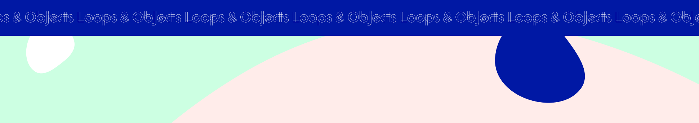

<h1 align="center">
  
</h1>

# JavaScript Loops & Objects

In this week’s team session, you will practice JavaScript basics and work on applying the concepts we have learned throughout the week. This will be done during the scheduled team session, you decide in the team if to do it in small groups or pairs.

### Instructions:

Take a look into the `index.js` file and follow the instructions to complete the exercises from 1-9.

## Getting Started with the Project

Fork this repository and start working in your local environment (you can download LiveServer to run your project locally).
